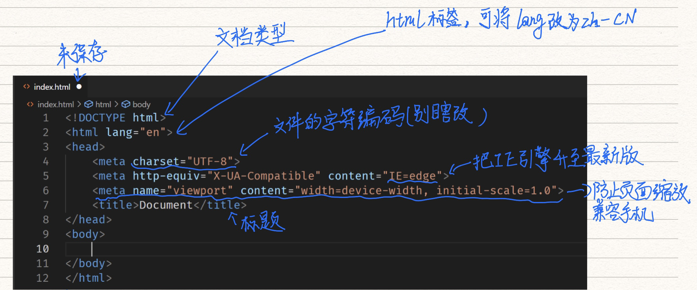

www(world wide web) = URL + HTTP + HTML
HTML之父：Tim Berners-Lee

## HTML 起手

`<head>`里面一般写的是看不见的元素

## 章节标签
* 标题  h1~h6
* 章节  section
* 文章  article
* 段落  p
* 头部  header
* 脚部  footer
* 主要内容  main
* 旁支内容  aside
* 划分  div

（补充）版权标志©写法:&copy

## 全局属性
**所有标签都有的属性**

* **class  给标签标记** 
可加多个,如：
```html
<div class="middle bordered">xxxxx</div>
```
我们便可在head中添加如下代码来更改字体和背景
```css
<style>
.middle{
    background:black; 
    color:white
    }
.bordered{
    border:10px solid red;
}
</style>
```
* **contenteditable  用户可直接编辑页面上的内容**
   * 例子：
   * 我们将style标签放入body中，设置`style{display:block}`,
   * 并给style 加上contenteditable属性，便可实现style属性在页面中直接编辑
   * [示例](http://js.jirengu.com/yizuj/1/edit?html,output)

* **hidden  隐藏标签**
   * 隐藏之后，可以通过CSS更改其element style为display:block将其显示


* **id**  功能类似于class，可以被CSS与Javascript直接调用，如：
```html
<header id="xxx">顶部</header>
```
可以通过JS来调用
```Javascript
xxx.style.border="10px solid green";
```
* 但需注意：
   * 这种情况下id的名称不是随意都能使用
   * （在控制台中打出window.时，里面所列的所有单词都不能被JS调用）
   * 如名称为top的id不能被JS调用，
   * 如需强行使用需写`document.getElementByID('top')`来实现调用
   * “元素全页面唯一，用id,元素全页面不唯一,用class”此说法有误，
   * *不到万不得已不要用id*，因为id不报错，会误导人


* **style  设置样式**
   * style 样式优先级：
      * JS>HTML的style属性>CSS


* **tabindex  使用tab建访问页面上的标签**
   * `tabindex=1/2/3/…` 给标签设置访问顺序
   * `tabindex=0`,最后访问
   * `tabindex=-1`,tab无法访问该标签


* **title  显示完整内容**
   * 用CSS实现文字过长变为省略号：
      * `white-space:nowrap`  不换行
      * `text-overflow: ellipsis`  溢出部分用省略号表示
      * `overflow:hidden`  溢出部分隐藏
   * 当给标签添加属性 title="完整的内容”时，便可在鼠标移动到省略部分时，显示出完整内容

## 默认样式
### 怎么看默认样式
1. chrome开发者工具
2. Elements -> Styles -> User agent stylesheet

### CSS reset
通过CSS reset对HTML默认样式进行修改，常见的CSS reset:
```CSS
* {
  margin: 0;
  padding: 0;
  box-sizing: border-box;
}
*::before,
*::after {
  box-sizing: border-box;
}
a {
  color: inherit;
  text-decoration: none;
}
input,
button {
  font-family: inherit;
}
ol,
ul {
  list-style: none;
}
table {
  border-collapse: collapse;
  border-spacing: 0;
}
```
资料来源：饥人谷

### 内容标签
* ol + li （ordered list + list item)  有序列表
* ul + li （unordered list + list item)  无序列表
* dl + dt +dd (description + term + data)
   * dt  被描述对象
   * dd  描述内容


* pre 
   * html规则:连续多个空格、回车会被压缩成一个空格
   * 用`<pre></pre>`将内容包住，即可呈现多个空格、回车

* code  代码
   * 代码需换行时，可用pre标签将其包裹
   * <pre><code>代码内容</code></pre>

* hr  水平分隔线
* br（break)  换行
* a （anchor)  链接
   * `<a href="链接">名称</a>`
   * 在标签里面添加`target="_blank"`实现在新窗口打开，不添加则默认当前窗口打开
* em (emphasis)  强调内容，默认字体为斜体
* strong   标记中间，默认字体加黑加粗
* quote  引用（表面上看不出来）
* blockquote  换行引用  将引用内容与段落换行